# 📚 Aluno Online API

## 📌 Descrição do Projeto

Este projeto consiste em uma API REST desenvolvida com Spring Boot para gerenciamento de alunos e professores.

A aplicação permite realizar operações de CRUD (Create, Read, Update e Delete) para as entidades Aluno e Professor, utilizando banco de dados PostgreSQL.

---

## 🚀 Tecnologias Utilizadas

- Java 21
- Spring Boot
- Spring Web
- Spring Data JPA
- PostgreSQL
- Lombok
- Insomnia (para testes)
- DBeaver (visualização do banco)

---

## 🧱 Arquitetura do Projeto

O projeto segue o padrão de arquitetura em camadas:

- **Model** → Representa as entidades e tabelas do banco de dados
- **Repository** → Responsável pelo acesso ao banco de dados
- **Service** → Contém as regras de negócio
- **Controller** → Responsável por receber as requisições HTTP

---

## 📂 Estrutura do Projeto

aluno_online
├── model
├── repository
├── service
├── controller

---

## 🔄 Endpoints da API

### 👨‍🎓 Alunos

- POST `/alunos` → Criar aluno
- GET `/alunos` → Listar todos os alunos
- GET `/alunos/{id}` → Buscar aluno por ID
- PUT `/alunos/{id}` → Atualizar aluno
- DELETE `/alunos/{id}` → Deletar aluno

---

### 👨‍🏫 Professores

- POST `/professores` → Criar professor
- GET `/professores` → Listar todos os professores
- GET `/professores/{id}` → Buscar professor por ID
- PUT `/professores/{id}` → Atualizar professor
- DELETE `/professores/{id}` → Deletar professor

---

## 📸 Testes no Insomnia

Aqui estão os testes realizados para validação dos endpoints:

### Aluno

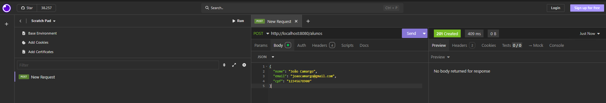
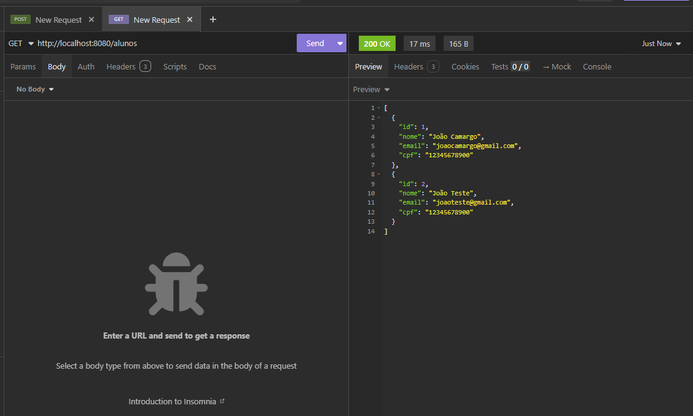
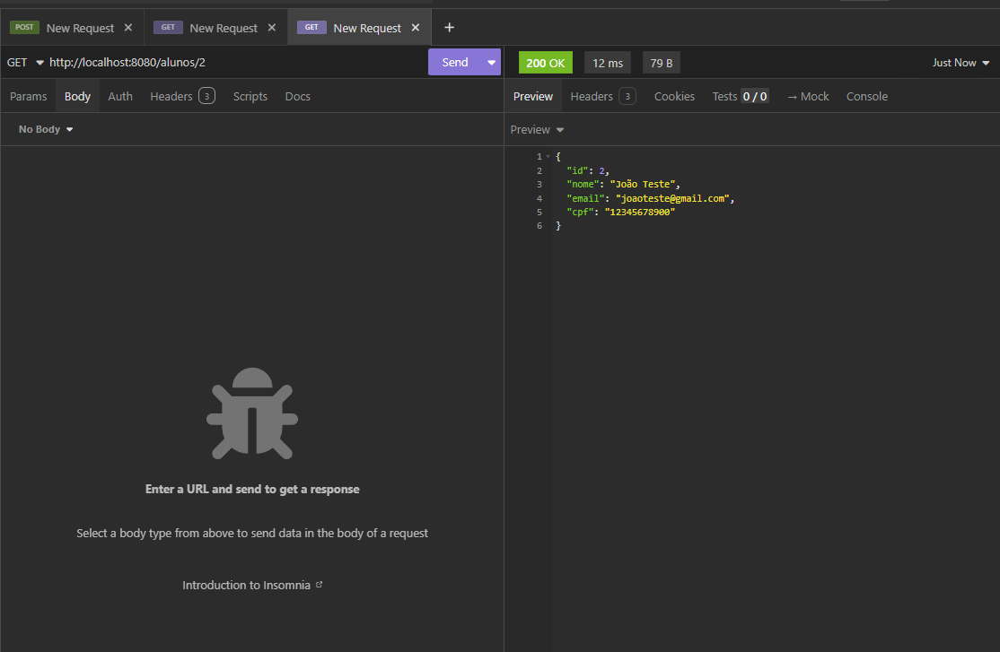
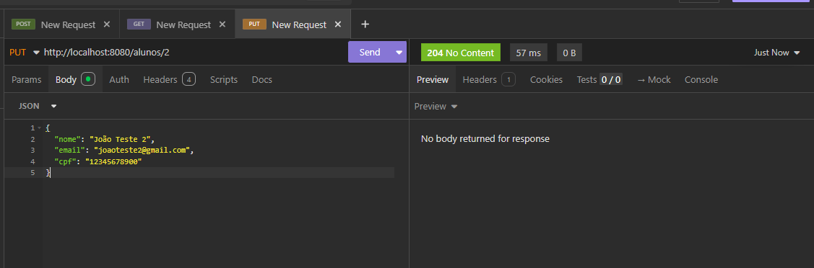
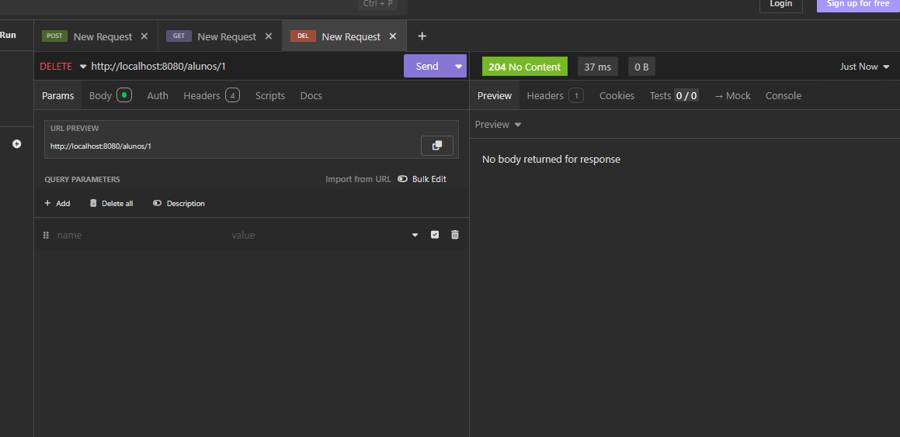

### Professor

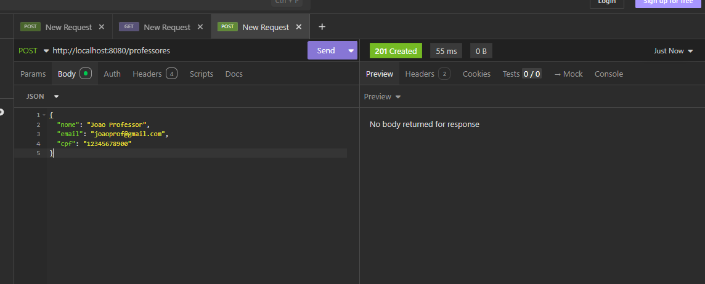
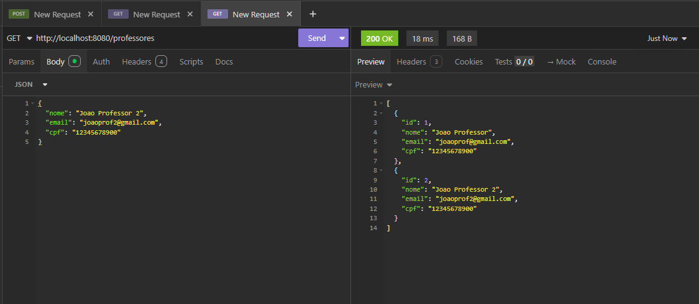
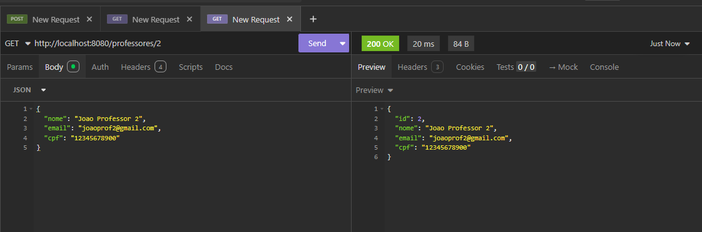
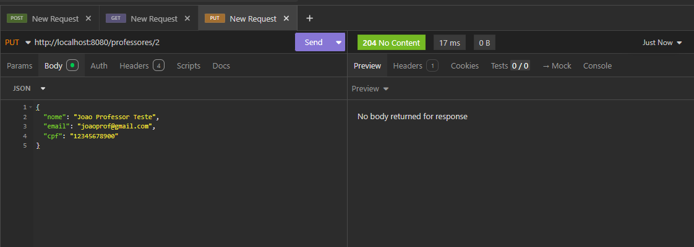
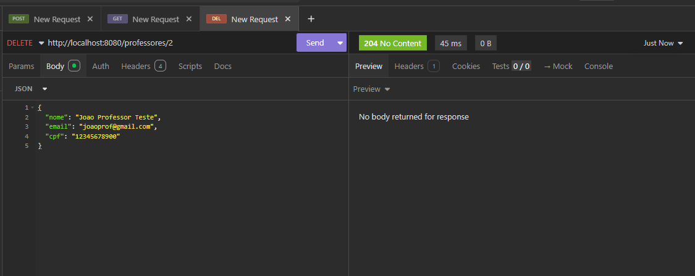

---

## 🗄️ Banco de Dados (DBeaver)

### Tabela Aluno

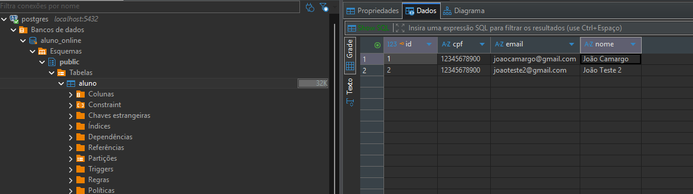

### Tabela Professor

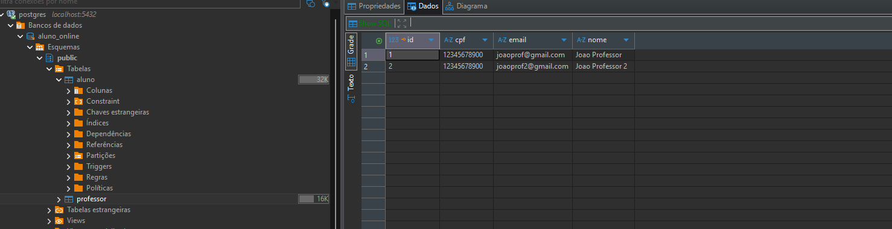