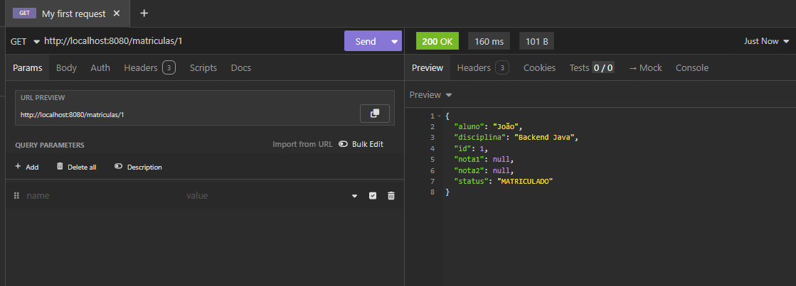
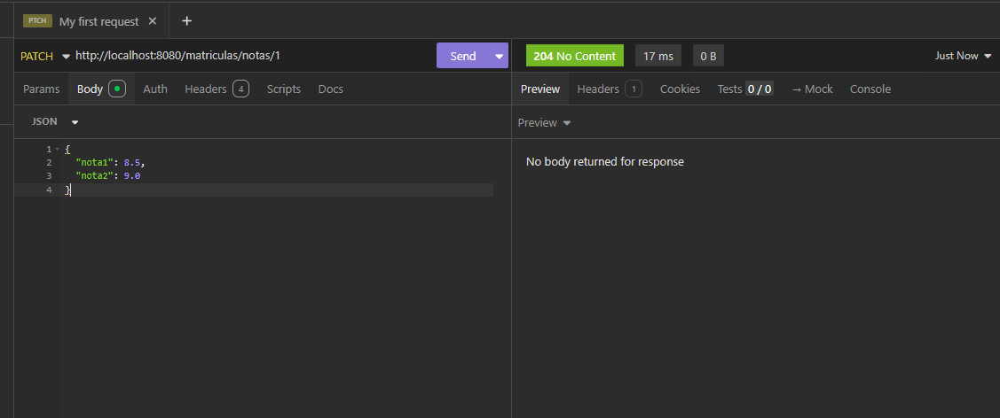
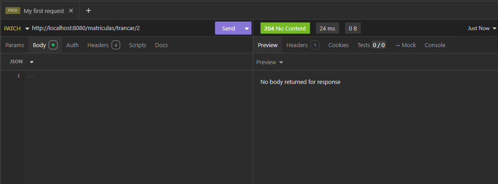
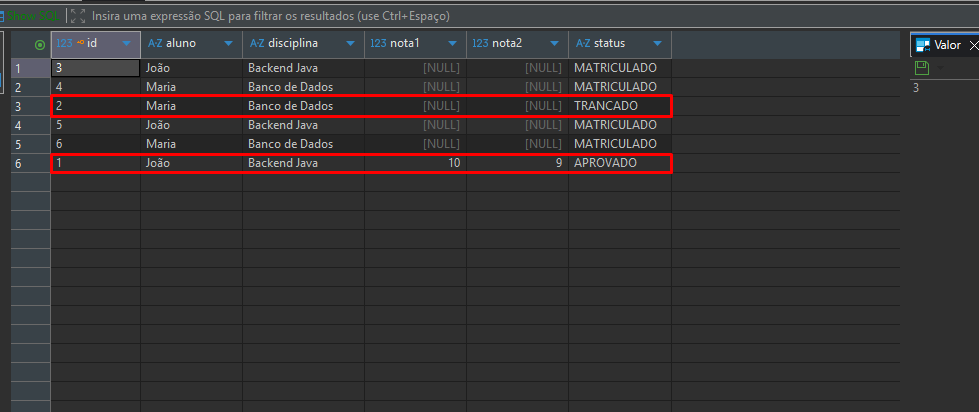

# 📚 Aluno Online API

## 📌 Descrição do Projeto

Este projeto consiste em uma API REST desenvolvida com Spring Boot para gerenciamento de matrículas de alunos.

A aplicação permite:

- Criar matrículas
- Listar matrículas
- Buscar matrícula por ID
- Atualizar notas
- Trancar matrícula

Os dados são persistidos em banco PostgreSQL utilizando Spring Data JPA.

---

## 🚀 Tecnologias Utilizadas

- Java 21
- Spring Boot
- Spring Web
- Spring Data JPA
- PostgreSQL
- Lombok
- Maven
- Insomnia
- DBeaver

---

## 🧱 Arquitetura do Projeto

O projeto segue arquitetura em camadas:

- Model
- Repository
- Service
- Controller
- DTO

---

## 📂 Estrutura do Projeto

```text
src/main/java/aluno_online
├── config
├── controller
├── dtos
├── model
├── repository
├── service
```

---

## 🔄 Endpoints da API

### 📘 Matrículas

| Método | Endpoint | Descrição |
|---|---|---|
| POST | `/matriculas` | Criar matrícula |
| GET | `/matriculas` | Listar matrículas |
| GET | `/matriculas/{id}` | Buscar matrícula por ID |
| PATCH | `/matriculas/notas/{id}` | Atualizar notas |
| PATCH | `/matriculas/trancar/{id}` | Trancar matrícula |

---

## 📸 Testes no Insomnia

### GET Matrículas


---

### GET Matrícula por ID



---

### PATCH Atualizar Notas



---

### PATCH Trancar Matrícula



---

## 🗄️ Banco de Dados (DBeaver)

### Tabela matricula_aluno


